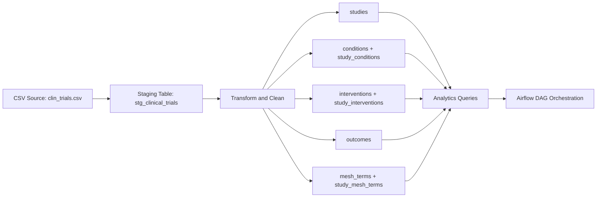

cat > README.md <<'EOF'
# Clinical Trial Data Pipeline

## Project Overview
This project implements a clinical trial data pipeline for a life sciences use case. The pipeline ingests raw clinical trial data from a CSV source, loads it into a PostgreSQL staging layer, transforms it into a normalized analytical schema, and runs SQL-based analytics on study characteristics, conditions, interventions, outcomes, and subject headings.

The goal of the project is to demonstrate practical data engineering skills across ingestion, data modeling, validation, transformation, SQL analytics, Docker-based local execution, testing, and orchestration.

The final solution supports both:
- **manual script-based execution**
- **Dockerized Airflow orchestration**

This allowed me to first build a clean and debuggable modular pipeline, and then add orchestration on top once the pipeline logic was stable.

---

## Architecture
High-level flow:

`CSV source -> staging table -> normalized core tables -> analytics queries -> Airflow orchestration`



Pipeline Layers
1. Raw ingestion layer
Input dataset: data/clin_trials.csv
Raw load into stg_clinical_trials
2. Curated transformation layer
Clean placeholder values such as Unknown, NA, and empty strings
Standardize categorical values
Generate a business key for deduplication
Normalize multi-value fields into relational child tables
3. Analytics layer
SQL queries for trial counts, common conditions, intervention completion behavior, organization distribution, and study timeline analysis
4. Orchestration layer
Airflow DAG executes:
database initialization
staging load
core transformation
analytics run

Project Structure

```
clinical-trial-pipeline/
├── dags/
│   └── clinical_trials_pipeline.py
├── data/
│   └── clin_trials.csv
├── src/
│   ├── analytics/
│   │   ├── analytics.sql
│   │   └── run_analytics.py
│   ├── db/
│   │   ├── connection.py
│   │   ├── init_db.py
│   │   └── schema.sql
│   ├── ingestion/
│   │   └── load_csv_to_staging.py
│   ├── transform/
│   │   └── transform_trials.py
│   └── utils/
│       └── helpers.py
├── tests/
│   └── test_helpers.py
├── .env.example
├── .gitignore
├── docker-compose.yml
├── Dockerfile
├── requirements.txt
└── README.md
```
