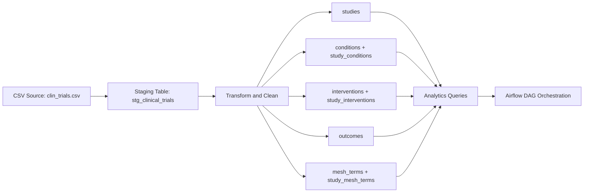

cat > README.md <<'EOF'
# Clinical Trial Data Pipeline

## Project Overview
This project implements a clinical trial data pipeline for a life sciences use case. The pipeline ingests raw clinical trial data from a CSV source, loads it into a PostgreSQL staging layer, transforms it into a normalized analytical schema, and runs SQL-based analytics on study characteristics, conditions, interventions, outcomes, and subject headings.

The goal of the project is to demonstrate practical data engineering skills across ingestion, data modeling, validation, transformation, SQL analytics, Docker-based local execution, testing, and orchestration.

The final solution supports both:
- **manual script-based execution**
- **Dockerized Airflow orchestration**

This allowed me to first build a clean and debuggable modular pipeline, and then add orchestration on top once the pipeline logic was stable.

---

## Architecture
High-level flow:

`CSV source -> staging table -> normalized core tables -> analytics queries -> Airflow orchestration`



Pipeline Layers
1. Raw ingestion layer
Input dataset: data/clin_trials.csv
Raw load into stg_clinical_trials
2. Curated transformation layer
Clean placeholder values such as Unknown, NA, and empty strings
Standardize categorical values
Generate a business key for deduplication
Normalize multi-value fields into relational child tables
3. Analytics layer
SQL queries for trial counts, common conditions, intervention completion behavior, organization distribution, and study timeline analysis
4. Orchestration layer
Airflow DAG executes:
database initialization
staging load
core transformation
analytics run

Project Structure

```
clinical-trial-pipeline/
├── dags/
│   └── clinical_trials_pipeline.py
├── data/
│   └── clin_trials.csv
├── src/
│   ├── analytics/
│   │   ├── analytics.sql
│   │   └── run_analytics.py
│   ├── db/
│   │   ├── connection.py
│   │   ├── init_db.py
│   │   └── schema.sql
│   ├── ingestion/
│   │   └── load_csv_to_staging.py
│   ├── transform/
│   │   └── transform_trials.py
│   └── utils/
│       └── helpers.py
├── tests/
│   └── test_helpers.py
├── .env.example
├── .gitignore
├── docker-compose.yml
├── Dockerfile
├── requirements.txt
└── README.md
```

Dataset Selection and Scope
I selected a CSV-based clinical trials dataset because it provided a strong foundation for demonstrating the core parts of the challenge:
ingestion
schema design
SQL proficiency
data cleaning
transformation logic
analytics
Docker
orchestration
testing
documentation
For the MVP, I intentionally prioritized a strong end-to-end implementation over trying to build shallow support for every possible source type at once.
The challenge also mentioned JSON APIs and SQL sources. Those are valid extensions, but the main implementation in this solution focuses on the CSV source so that the full pipeline could be delivered in a working, explainable, and testable state.
Data Model
The source file is a denormalized study-level CSV, so the target model separates raw ingestion from curated analytical tables.
Staging
stg_clinical_trials
Core tables
studies
conditions
study_conditions
interventions
study_interventions
outcomes
mesh_terms
study_mesh_terms
Table Roles
stg_clinical_trials
Raw landing table that preserves the source dataset almost as-is.
Purpose:
preserve source fidelity
simplify debugging
support reprocessing
separate ingestion from transformation
studies
Main master table. One row represents one cleaned and deduplicated clinical study.
conditions
Stores unique condition values as a reusable dimension table.
study_conditions
Bridge table between studies and conditions to resolve the many-to-many relationship.
interventions
Stores unique intervention values as a reusable dimension table.
study_interventions
Bridge table between studies and interventions.
outcomes
Stores study-level outcome measures as child rows because they are descriptive, high-cardinality text.
mesh_terms
Stores unique medical subject heading terms.
study_mesh_terms
Bridge table between studies and subject heading terms.
Design Decisions
Staging-first architecture
A staging table is used to preserve raw source values and simplify reprocessing/debugging.
Surrogate primary key
A surrogate primary key (study_id) is used in the curated model for stable relationships between tables.
Generated business key
Because the dataset does not provide a reliable natural study identifier in the provided CSV, a business key is generated from:
brief_title
organization_full_name
start_date_raw
This key is used as a practical deduplication strategy.
Normalization of many-to-many fields
Multi-valued source columns such as conditions, interventions, and medical subject headings are normalized into dimension and bridge tables.
Outcome modeling
Outcome measures are stored as child rows because they are high-cardinality free text and do not behave like a reusable low-cardinality dimension.
SQL-first transformation for scale
The initial transformation logic was Python-driven, but for better performance on a large dataset I moved the heavy transformation work into set-based SQL. This made the solution more efficient and better aligned with the strengths of PostgreSQL.
Data Cleaning and Transformation Rules
The pipeline applies the following transformation rules:
Convert placeholder values such as Unknown, NA, N/A, null, and empty strings to NULL
Normalize categorical values to uppercase underscore format where appropriate
Parse start_date_raw into:
start_date
start_date_precision
Split multi-valued columns using comma-based parsing for the MVP
Deduplicate studies using the generated business key
Preserve long free-text intervention descriptions in the studies table
Start date handling
Because the source dataset contains mixed date formats, the pipeline preserves both:
a normalized start_date
a start_date_precision field that indicates whether the original value had day, month, or year precision
This makes downstream analysis more honest and reduces the risk of overstating date precision.
