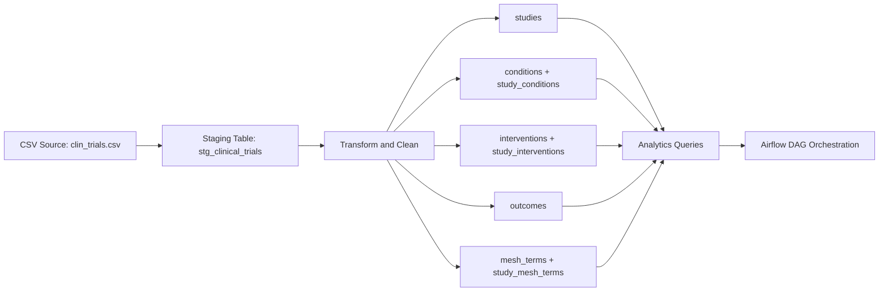

cat > README.md <<'EOF'
# Clinical Trial Data Pipeline

## Project Overview
This project implements a clinical trial data pipeline for a life sciences use case. The pipeline ingests raw clinical trial data from a CSV source, loads it into a PostgreSQL staging layer, transforms it into a normalized analytical schema, and runs SQL-based analytics on study characteristics, conditions, interventions, outcomes, and subject headings.

The goal of the project is to demonstrate practical data engineering skills across ingestion, data modeling, validation, transformation, SQL analytics, Docker-based local execution, testing, and orchestration.

The final solution supports both:
- **manual script-based execution**
- **Dockerized Airflow orchestration**

This allowed me to first build a clean and debuggable modular pipeline, and then add orchestration on top once the pipeline logic was stable.

---

## Architecture
High-level flow:

`CSV source -> staging table -> normalized core tables -> analytics queries -> Airflow orchestration`



Pipeline Layers
1. Raw ingestion layer
Input dataset: data/clin_trials.csv
Raw load into stg_clinical_trials
2. Curated transformation layer
Clean placeholder values such as Unknown, NA, and empty strings
Standardize categorical values
Generate a business key for deduplication
Normalize multi-value fields into relational child tables
3. Analytics layer
SQL queries for trial counts, common conditions, intervention completion behavior, organization distribution, and study timeline analysis
4. Orchestration layer
Airflow DAG executes:
database initialization
staging load
core transformation
analytics run

Project Structure

```
clinical-trial-pipeline/
├── dags/
│   └── clinical_trials_pipeline.py
├── data/
│   └── clin_trials.csv
├── src/
│   ├── analytics/
│   │   ├── analytics.sql
│   │   └── run_analytics.py
│   ├── db/
│   │   ├── connection.py
│   │   ├── init_db.py
│   │   └── schema.sql
│   ├── ingestion/
│   │   └── load_csv_to_staging.py
│   ├── transform/
│   │   └── transform_trials.py
│   └── utils/
│       └── helpers.py
├── tests/
│   └── test_helpers.py
├── .env.example
├── .gitignore
├── docker-compose.yml
├── Dockerfile
├── requirements.txt
└── README.md
```

Dataset Selection and Scope

I selected a CSV-based clinical trials dataset because it provided a strong foundation for demonstrating the core parts of the challenge:

ingestion

schema design

SQL proficiency

data cleaning

transformation logic

analytics

Docker

orchestration

testing

documentation

For the MVP, I intentionally prioritized a strong end-to-end implementation over trying to build shallow support for every possible source type at once.

The challenge also mentioned JSON APIs and SQL sources. Those are valid extensions, but the main implementation in this solution focuses on the CSV source so that the full pipeline could be delivered in a working, explainable, and testable state.

Data Model

The source file is a denormalized study-level CSV, so the target model separates raw ingestion from curated analytical tables.

Staging

stg_clinical_trials

Core tables

studies

conditions

study_conditions

interventions

study_interventions

outcomes

mesh_terms

study_mesh_terms

Table Roles

stg_clinical_trials

Raw landing table that preserves the source dataset almost as-is.
Purpose:

preserve source fidelity

simplify debugging

support reprocessing

separate ingestion from transformation

studies

Main master table. One row represents one cleaned and deduplicated clinical study.

conditions

Stores unique condition values as a reusable dimension table.

study_conditions

Bridge table between studies and conditions to resolve the many-to-many relationship.

interventions

Stores unique intervention values as a reusable dimension table.

study_interventions

Bridge table between studies and interventions.

outcomes

Stores study-level outcome measures as child rows because they are descriptive, high-cardinality text.

mesh_terms

Stores unique medical subject heading terms.

study_mesh_terms

Bridge table between studies and subject heading terms.

Design Decisions

Staging-first architecture

A staging table is used to preserve raw source values and simplify reprocessing/debugging.

Surrogate primary key

A surrogate primary key (study_id) is used in the curated model for stable relationships between tables.

Generated business key

Because the dataset does not provide a reliable natural study identifier in the provided CSV, a business key is generated from:

brief_title

organization_full_name

start_date_raw

This key is used as a practical deduplication strategy.

Normalization of many-to-many fields

Multi-valued source columns such as conditions, interventions, and medical subject headings are normalized into dimension and bridge tables.

Outcome modeling

Outcome measures are stored as child rows because they are high-cardinality free text and do not behave like a reusable low-cardinality dimension.

SQL-first transformation for scale

The initial transformation logic was Python-driven, but for better performance on a large dataset I moved the heavy transformation work into set-based SQL. This made the solution more efficient and better aligned with the strengths of PostgreSQL.

Data Cleaning and Transformation Rules

The pipeline applies the following transformation rules:

Convert placeholder values such as Unknown, NA, N/A, null, and empty strings to NULL

Normalize categorical values to uppercase underscore format where appropriate

Parse start_date_raw into:

start_date

start_date_precision

Split multi-valued columns using comma-based parsing for the MVP

Deduplicate studies using the generated business key

Preserve long free-text intervention descriptions in the studies table

Start date handling

Because the source dataset contains mixed date formats, the pipeline preserves both:

a normalized start_date

a start_date_precision field that indicates whether the original value had day, month, or year precision

This makes downstream analysis more honest and reduces the risk of overstating date precision.

Execution Flow

Manual Script Execution

The pipeline can be executed directly without Airflow.

1. Create database schema

python3 -m src.db.init_db

2. Load raw CSV into staging

python3 -m src.ingestion.load_csv_to_staging

3. Transform staged data into core tables

python3 -m src.transform.transform_trials

4. Run analytics

python3 -m src.analytics.run_analytics

Airflow-Orchestrated Execution

The project also includes a Dockerized Airflow setup.

DAG tasks

init_db

load_staging

transform_core

run_analytics

This allows the full pipeline to be executed as one reproducible orchestrated workflow.

Docker and Airflow

This project uses Docker for:

PostgreSQL

Airflow webserver

Airflow scheduler

Airflow initialization

Start services

docker compose up -d --build

Initialize Airflow metadata and user

docker compose up airflow-init

Open Airflow UI

Open:

http://localhost:8080

Airflow login

Username: admin

Password: admin

Check running containers

docker ps

Analytics Implemented

The project includes SQL queries for:

Trials by study type and phase

Most common conditions being studied

Interventions with highest completion counts and completion rates

Organization distribution by organization class

Timeline analysis by study start year

These analytics were implemented in src/analytics/analytics.sql and can be run through src/analytics/run_analytics.py.

Sample Results Summary

On the processed dataset, the pipeline produced approximately:

495,558 studies

110,162 distinct conditions

443,231 distinct interventions

479,135 outcomes

63,520 medical subject heading terms

Initial analytics showed that:

INTERVENTIONAL and OBSERVATIONAL are the dominant study types

common conditions include Healthy, Breast Cancer, Obesity, and Diabetes Mellitus

organization classes are dominated by OTHER, followed by INDUSTRY and NIH

Testing

Unit tests are included for core helper functions such as:

placeholder normalization

category normalization

date parsing

multi-value splitting

business key generation

Run tests with:

pytest tests/test_helpers.py

Current Status

Implemented

CSV ingestion into PostgreSQL staging

normalized core schema

data cleaning and transformation

SQL analytics queries

Dockerized PostgreSQL local setup

Dockerized Airflow orchestration

Airflow DAG execution

unit tests for helper functions

Deferred to future iteration

API ingestion

SQL source ingestion

production-grade logging and monitoring

stronger integration and data-quality testing

Trade-offs and Limitations

This solution is intentionally scoped as an MVP.

Trade-offs made

The primary implemented source is CSV, even though the challenge also mentions JSON APIs and SQL databases.

Multi-value parsing uses comma-based splitting, which is simple but not semantically perfect for all medical text.

Geographic analysis was not implemented because the chosen dataset does not expose clear location fields in the provided CSV structure.

The generated business key is a practical surrogate for deduplication, but not a perfect replacement for a true source identifier such as an NCT ID.

Airflow uses SQLite metadata and SequentialExecutor in the local demo environment for simplicity, even though production would require a stronger setup.

Limitations

No production-grade logging framework yet

No incremental loading strategy yet

No data quality audit table yet

No API ingestion module implemented in the final MVP

No SQL source ingestion module implemented in the final MVP

No production-grade Airflow metadata backend yet

Time Allocation Breakdown

Approximate time allocation:

Setup and architecture: 20%

Schema design and transformation logic: 35%

Data loading and debugging: 20%

Analytics and validation: 10%

Airflow and Docker orchestration: 10%

Testing and documentation: 5%

Scalability: How would this handle 100x more data?

For 100x more data, I would not rely only on the current single-node PostgreSQL-centered processing pattern. While the current solution is appropriate for an MVP and moderate-scale workloads, a significantly larger workload would require architectural changes.

The main improvements I would make are:

move from full reloads to incremental or CDC-style ingestion

introduce distributed transformation with PySpark

convert raw CSV files into Parquet or Delta format

apply compression such as GZIP

store analytical files in object storage such as MinIO

separate storage from compute

introduce a distributed query engine such as Dremio, Trino, or similar

partition large datasets by appropriate business or temporal keys

push toward a lakehouse architecture with raw, cleaned, and curated layers

improve orchestration, observability, retry logic, and data-quality controls

In other words, the current implementation is a strong relational MVP, but for much larger scale I would evolve it toward a distributed lakehouse architecture rather than only vertically scaling PostgreSQL.

Data Quality: Additional Validation Rules for Clinical Trial Data

I would add:

stricter status-domain validation

valid phase-value enforcement

title length and non-empty content checks

date consistency checks

duplicate-study anomaly detection

stronger parsing/validation for multi-valued fields

source-level audit tables for rejected/flagged rows

Compliance: GxP Considerations

In a GxP-regulated environment, I would add:

full audit trails for ingestion and transformation

versioned datasets and reproducible pipeline runs

controlled deployment and change management

validated scripts and environments

access control and separation of duties

documented test evidence and approval workflow

Monitoring: Production Monitoring Approach

In production, I would monitor:

pipeline run status and duration

source row counts vs loaded row counts

rejected/null/invalid record rates

duplicate rates

freshness / latency metrics

SQL query performance

infrastructure health

alerting for failures and abnormal data-quality drift

Security: Sensitive Clinical Data Protections

For sensitive clinical data, I would implement:

least-privilege DB access

secrets management instead of plaintext env files

encryption at rest and in transit

network restrictions

audit logging

PII/PHI classification and masking where needed

role-based access to raw vs curated layers

Future Improvements

If I had more time, I would evolve this project from a single-node analytical pipeline into a more scalable lakehouse-oriented architecture.

1. Introduce a data lake / lakehouse layer

The current solution uses PostgreSQL as the primary analytical store, which works well for the MVP and for demonstrating normalized schema design and SQL analytics. For a larger-scale production architecture, I would introduce a data lake or lakehouse layer to support cheaper storage, better scalability, and more flexible downstream analytics.

2. Use PySpark for distributed transformation

Instead of relying only on local Python and database-side transformation, I would use PySpark for distributed data processing. This would allow the pipeline to scale much better for significantly larger datasets and more complex transformations.

A likely future flow would be:

CSV -> PySpark -> Parquet / Delta -> MinIO -> query engine / warehouse layer

3. Convert raw CSV into columnar storage formats

I would transform raw CSV files into columnar formats such as:

Parquet for efficient analytical reads

Delta Lake format for transactional consistency, schema evolution, and better incremental processing support

This would significantly improve read performance compared to raw CSV and make the platform more suitable for large-scale analytics.

4. Apply compression

I would use compression such as GZIP during file generation and storage to reduce storage costs and improve transfer efficiency, especially for larger datasets and repeated processing.

5. Store data in object storage such as MinIO

I would use MinIO as an S3-compatible object storage layer for the lakehouse. This would separate storage from compute and make the system more flexible, scalable, and cloud-compatible.

6. Add a distributed query engine

On top of the lakehouse layer, I would introduce a distributed query engine such as Dremio or similar technologies like Trino/Presto. This would make it possible to query Parquet/Delta datasets directly, accelerate analytics, and support BI/reporting workloads more efficiently.

7. Move toward a medallion-style layered model

A more mature version of the platform would likely use layered data zones such as:

Bronze: raw ingested data

Silver: cleaned and standardized data

Gold: analytics-ready curated datasets

This would make the pipeline easier to maintain, audit, and extend over time.

8. Support incremental and event-driven processing

The current MVP uses a full-load approach. In a more advanced architecture, I would add:

incremental ingestion

partitioning strategies

schema evolution handling

reprocessing controls

better orchestration around late-arriving or corrected data

9. Improve analytical serving

For end-user analytics, I would evaluate whether the best consumption layer should remain PostgreSQL, move to a warehouse-style system, or use a query engine directly on top of the lakehouse depending on performance, cost, and usage patterns.

Overall, the current implementation is a strong relational MVP, but the next major architectural step would be to evolve it into a distributed lakehouse design using PySpark, Parquet/Delta, MinIO, and a distributed query
