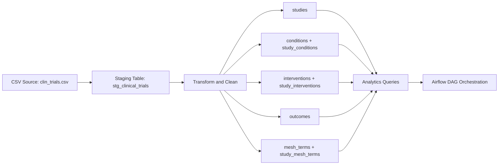

# Clinical Trial Data Pipeline

## Project Overview

This project implements a clinical trial data pipeline for a life sciences use case.

The pipeline ingests raw clinical trial data from a CSV source, loads it into a PostgreSQL staging layer, transforms it into a normalized analytical schema, and runs SQL-based analytics on study characteristics, conditions, interventions, outcomes, and subject headings.

The goal of the project is to demonstrate practical data engineering skills across ingestion, data modeling, validation, transformation, SQL analytics, Docker-based local execution, testing, and orchestration.

---

## Architecture

High-level flow:

`CSV source -> staging table -> normalized core tables -> analytics queries -> Airflow orchestration`

## Pipeline Layers
1. Raw ingestion layer
    Input dataset: data/clin_trials.csv
    Raw load into stg_clinical_trials
2. Curated transformation layer
Clean placeholder values such as Unknown, NA, and empty strings
Standardize categorical values
Generate a business key for deduplication
Normalize multi-value fields into relational child tables
3. Analytics layer
SQL queries for trial counts
Common conditions analysis
Intervention completion behavior
Organization distribution
Study timeline analysis
4. Orchestration layer
Airflow DAG executes:
database initialization
staging load
core transformation
analytics run

Pipeline Layers

The pipeline is structured into four logical layers: raw ingestion, curated transformation, analytics, and orchestration.

The raw ingestion layer reads the input dataset from data/clin_trials.csv and loads it directly into the PostgreSQL staging table stg_clinical_trials without modification.

The curated transformation layer is responsible for cleaning and structuring the data. It standardizes placeholder values such as Unknown and NA, normalizes categorical fields, generates a business key for deduplication, and converts multi-value fields into properly normalized relational tables.

The analytics layer consists of SQL queries that analyze trial characteristics, including study counts, common conditions, intervention performance, organizational distribution, and study timelines.

The orchestration layer is implemented using Airflow, where a DAG coordinates the full pipeline by executing database initialization, staging load, transformation, and analytics steps in sequence.

Project Structure

The project is organized into modular components that separate concerns across ingestion, transformation, analytics, and orchestration.

The dags/ directory contains the Airflow pipeline definition. The data/ directory holds the input dataset. The src/ directory contains the core application logic, split into submodules for analytics, database setup, ingestion, transformation, and utility functions. Tests are located in the tests/ directory and validate key transformation and helper logic. Supporting files such as Docker configuration, environment variables, and dependencies are included at the root level.

Data Model

The source dataset is a denormalized study-level CSV file. To support analytical use cases, the pipeline separates raw ingestion from a curated relational model.

A staging table, stg_clinical_trials, is used to preserve the original data and allow for reprocessing and debugging. The curated layer consists of normalized core tables including studies, conditions, interventions, outcomes, and medical subject headings, along with bridge tables to handle many-to-many relationships.

A surrogate primary key (study_id) is used in the curated model. Since the dataset does not provide a reliable unique identifier, a business key is generated using a combination of brief_title, organization_full_name, and start_date_raw.

Multi-valued columns from the source dataset are split into separate dimension and bridge tables, while high-cardinality free-text fields such as outcomes are stored as child records.

Data Cleaning and Transformation Rules

The pipeline applies a consistent set of transformation rules to ensure data quality and usability.

Placeholder values such as Unknown, NA, N/A, and empty strings are converted to NULL. Categorical values are normalized into a standardized uppercase underscore format. The start_date_raw field is parsed into structured date and precision components.

Multi-value columns are split using comma-based parsing as part of the MVP implementation. Duplicate studies are identified and removed using the generated business key. Free-text fields are preserved to maintain completeness of the original data.

Analytics Implemented

The project includes a set of SQL-based analyses designed to extract insights from the curated dataset.

These analyses cover study distribution by type and phase, the most frequently studied conditions, intervention completion rates, organizational distribution across different classes, and trends in study start dates over time.

Sample Results Summary

On the processed dataset, the pipeline produced several hundred thousand records across multiple entities, including studies, conditions, interventions, outcomes, and medical subject headings.

Initial analysis shows that INTERVENTIONAL and OBSERVATIONAL studies dominate the dataset. Commonly studied conditions include healthy subjects, breast cancer, obesity, and diabetes mellitus. Organizational classifications are largely dominated by the OTHER category, followed by INDUSTRY and NIH.

Dataset

The original dataset is not included in this repository due to GitHub file size limitations.

To run the pipeline locally, the dataset should be placed at data/clin_trials.csv. A smaller sample dataset may also be used for testing and demonstration purposes.

Local Setup Instructions

The project can be executed locally using Docker and Airflow.

After starting the services with Docker Compose and initializing Airflow, the web interface becomes available at http://localhost:8080. Once logged in, the user can trigger the pipeline DAG to execute the full workflow from ingestion to analytics.

Manual Script Execution

In addition to Airflow orchestration, the pipeline can be executed manually using modular Python scripts.

The process involves initializing the database schema, loading the raw data into the staging table, transforming the data into the curated schema, and finally running the analytics queries.

Docker

Docker is used to provide a consistent local environment for PostgreSQL and Airflow components. This simplifies setup and ensures reproducibility across different systems.

Airflow Orchestration

The Airflow DAG defines the full pipeline workflow and enforces task dependencies.

It executes four main steps: database initialization, staging ingestion, core transformation, and analytics execution. This ensures that the pipeline runs as a cohesive and repeatable process.

Testing

Unit tests are included to validate core transformation logic and helper functions.

These tests cover placeholder normalization, categorical standardization, date parsing, multi-value splitting, and business key generation, ensuring correctness of the data processing logic.

Current Status

The current implementation includes CSV ingestion, a normalized schema, transformation logic, SQL analytics, Docker-based execution, Airflow orchestration, and unit testing.

Future improvements include support for API and SQL ingestion, enhanced logging and monitoring, and more comprehensive data quality validation.

Trade-offs and Limitations

This project is intentionally scoped as a minimum viable pipeline.

It focuses on CSV ingestion, uses simplified parsing for multi-value fields, and relies on a generated business key instead of a true source identifier. The Airflow setup is optimized for local development rather than production use.

Additional limitations include the absence of incremental loading, advanced logging, and production-grade data validation.

Scalability

To handle significantly larger data volumes, the pipeline could be extended with incremental ingestion strategies, table partitioning, bulk loading techniques, and improved query optimization.

A transition to a data warehouse or lakehouse architecture would further improve scalability for analytical workloads.

Data Quality

Additional validation rules could include stricter domain enforcement, consistency checks, duplicate detection, and enhanced validation of multi-value fields.

Audit tables could also be introduced to track rejected or invalid records.

Compliance

In a regulated environment, the pipeline would require audit trails, versioned datasets, controlled deployments, validated environments, and strict access controls.

Monitoring

A production-ready version of the pipeline would include monitoring of pipeline execution, data quality metrics, performance, and infrastructure health, along with alerting mechanisms.

Security

Security enhancements would include least-privilege access control, secrets management, encryption, network restrictions, and data masking for sensitive information.

Execution Notes

This project was initially developed using modular Python scripts and later orchestrated with Dockerized Airflow. This approach enabled efficient development and debugging while still demonstrating a complete, production-style pipeline design.
